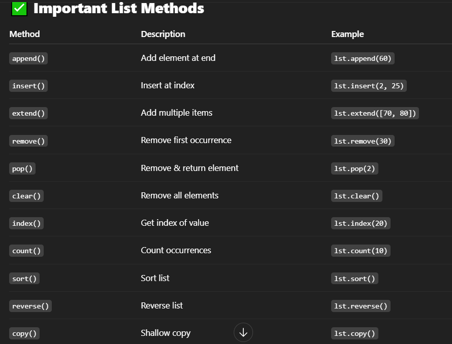
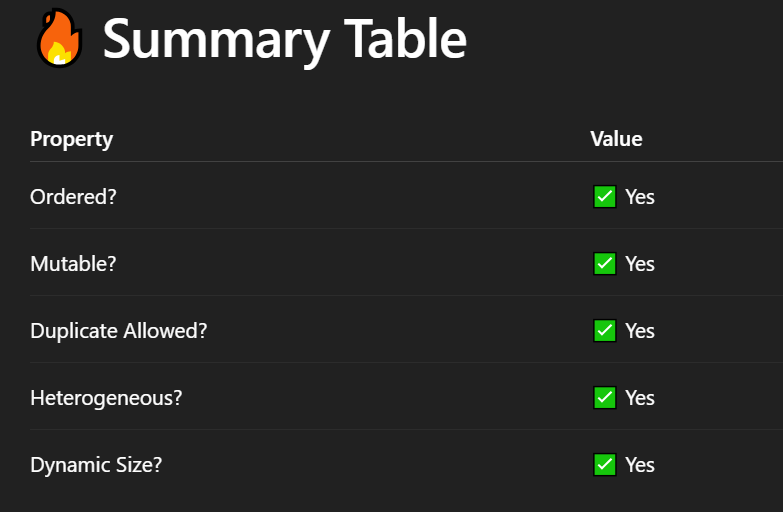

# list :
- A list is a collection of ordered, mutable, and heterogeneous elements.
- You can store numbers, strings, other lists, or even mix different types.
```
my_list = [10, "Python", 3.14, True]
```

## ✅ Why Lists are Important ?
- Ordered: You can access elements by index.

- Mutable: You can change, add, remove elements.

- Supports duplicates.

- Can be nested.


```
lst = [1, 3, 5, 7]
lst.append(9)
lst.insert(2, 4)
lst.remove(5)
lst.sort()
lst.reverse()
print(lst)

# Output: [9, 7, 4, 3, 1]

````

