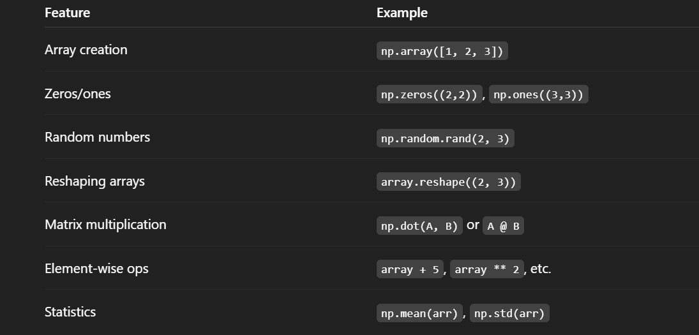
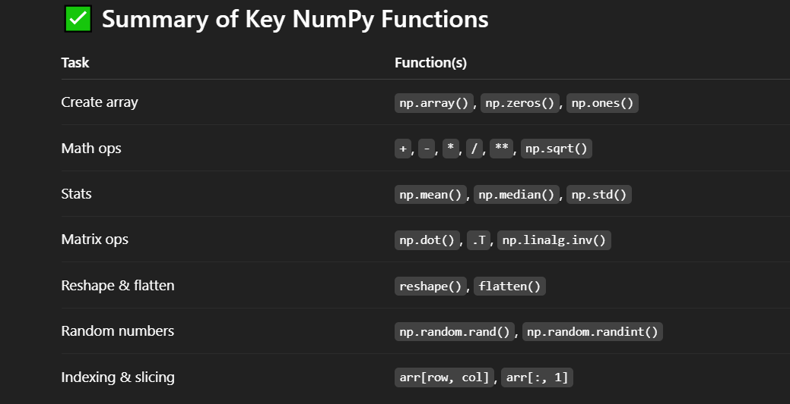

# Numpy :
- NumPy (Numerical Python) is a powerful open-source library used for numerical and scientific computing in Python. 

## It provides :

- An efficient N-dimensional array object called ndarray

- Functions for mathematical operations on arrays

- Tools for integrating C/C++ and Fortran code

- Linear algebra, Fourier transforms, and random number capabilities

## Installation :
```
pip install numpy
```

## 🧠 Why Use NumPy ?
### Compared to Python lists, NumPy arrays:

- Use less memory

- Are faster due to optimized C-based backend

- Support element-wise operations (like vectorized math)

```
import numpy as np

# Create a 1D array
a = np.array([1, 2, 3, 4])

# Create a 2D array
b = np.array([[1, 2], [3, 4]])

# Perform element-wise addition
c = a + 10

print(c)  # Output: [11 12 13 14]

```


## Example Use Case: Matrix Multiplication :
```
A = np.array([[1, 2], [3, 4]])
B = np.array([[2, 0], [1, 2]])

result = np.dot(A, B)
print(result)

# Output:
# [[ 4  4]
#  [10  8]]

```

## Summary :
### NumPy is essential for :

- Data science

- Machine learning

- Scientific computing

-   Engineering simulations



## 1. Create Arrays :
```
import numpy as np

# 1D array
a = np.array([10, 20, 30])
print(a)

# 2D array
b = np.array([[1, 2], [3, 4]])
print(b)

# Array of zeros
zeros = np.zeros((2, 3))
print(zeros)

# Array of ones
ones = np.ones((3, 2))
print(ones)

# Array with a range of numbers
r = np.arange(0, 10, 2)
print(r)  # [0 2 4 6 8]

# Array with evenly spaced numbers (linspace)
l = np.linspace(0, 1, 5)
print(l)  # [0.   0.25 0.5  0.75 1.  ]

```

## 2. Array Operations (Element-wise) :
```
x = np.array([1, 2, 3])
y = np.array([4, 5, 6])

print(x + y)  # [5 7 9]
print(x * y)  # [4 10 18]
print(x ** 2)  # [1 4 9]
print(np.sqrt(x))  # [1. 1.414 1.732]

```

## 3. Matrix Operations :
```
A = np.array([[1, 2], [3, 4]])
B = np.array([[2, 0], [1, 2]])

# Matrix multiplication
print(np.dot(A, B))

# Transpose
print(A.T)

# Inverse
inv_A = np.linalg.inv(A)
print(inv_A)

```

## 4. Statistics :
```
data = np.array([1, 2, 3, 4, 5, 6])

print("Mean:", np.mean(data))       # 3.5
print("Median:", np.median(data))   # 3.5
print("Standard Deviation:", np.std(data))  # ~1.71
print("Sum:", np.sum(data))         # 21

```
## 🔁 5. Reshape and Flatten :
```
arr = np.array([[1, 2, 3], [4, 5, 6]])

# Reshape to 3x2
reshaped = arr.reshape((3, 2))
print(reshaped)

# Flatten to 1D
flat = arr.flatten()
print(flat)

```

## 6. Indexing and Slicing :
```
arr = np.array([[10, 20, 30], [40, 50, 60]])

print(arr[0, 1])  # 20
print(arr[:, 1])  # [20 50] (all rows, 2nd column)
print(arr[1, :])  # [40 50 60] (2nd row, all columns)

```

##  7. Random Numbers:
```
python
Copy
Edit
# Random float between 0 and 1
print(np.random.rand())

# Random 2x3 array
print(np.random.rand(2, 3))

# Random integers between 1 and 10
print(np.random.randint(1, 10, size=(3, 2)))

# Set a seed for reproducibility
np.random.seed(0)
print(np.random.rand(2))

```

## 8. Broadcasting :
```
a = np.array([1, 2, 3])
b = 2

# Adds 2 to each element
print(a + b)  # [3 4 5]

# Multiply each element by 3
print(a * 3)  # [3 6 9]

```
