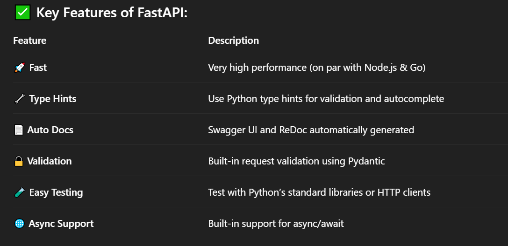

# FastAPI :
- FastAPI is a modern, high-performance web framework for building APIs with Python 3.7+, based on:

- Python type hints for data validation

- Pydantic for request/response parsing and validation

- Starlette for web handling and performance

- It’s designed to make it easy, fast, and efficient to build APIs that are easy to write, fast to run, and automatically documented.



## 🧠 How It Works :
### FastAPI uses type annotations to :

- Define the structure of requests (query params, body, headers)

- Validate and parse incoming data

- Generate OpenAPI docs automatically

## Example: A Basic API
```
from fastapi import FastAPI
from pydantic import BaseModel

app = FastAPI()

class Item(BaseModel):
    name: str
    price: float
    in_stock: bool = True

@app.get("/")
def read_root():
    return {"message": "Welcome to FastAPI!"}

@app.post("/items/")
def create_item(item: Item):
    return {"item_received": item}

```    

## 🌐 Running the Server :
```
uvicorn main:app --reload
```
- main is the Python file name (main.py)

- app is the FastAPI instance

- --reload auto-reloads code changes (great for dev)

## 📦 Use Cases :
- REST APIs and Microservices

- Backend for frontend apps

- ML model serving (e.g., with TensorFlow or PyTorch)

- Fast, async-friendly apps (WebSockets, background tasks)

