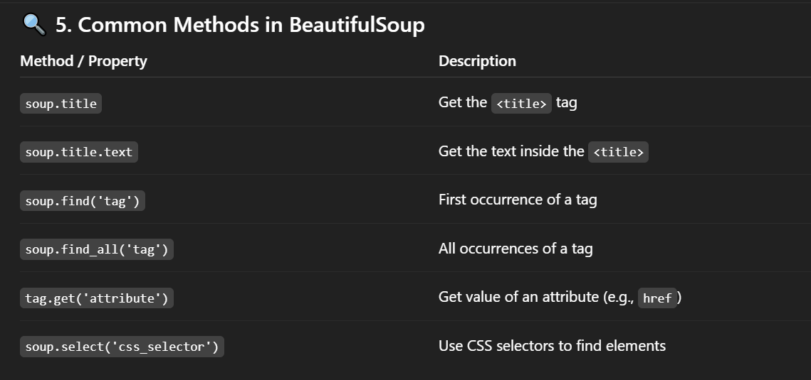
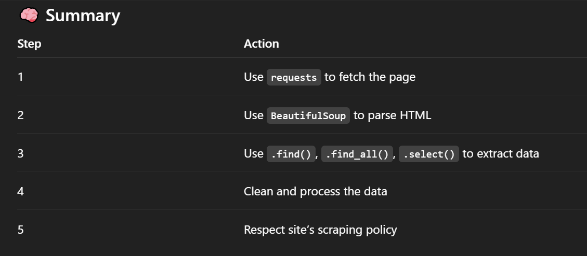

# Web Scraping :
- Web scraping is the process of automatically extracting information from websites.

## Tools Used :

- requests: To fetch the HTML content of a webpage.

- BeautifulSoup (from bs4): To parse and extract data from HTML/XML.

## Installing Packages :

```
pip install requests beautifulsoup4
```
## basic Example :
```
import requests
from bs4 import BeautifulSoup

# Step 1: Fetch the page
url = 'https://example.com'
response = requests.get(url)

# Step 2: Parse the HTML
soup = BeautifulSoup(response.text, 'html.parser')

# Step 3: Extract data
title = soup.title.text
print(title)

```



## Example: Scraping All Links :
```
links = soup.find_all('a')
for link in links:
    href = link.get('href')
    print(href)

```

## Finding by Class or ID :
```
# Find by class
soup.find('div', class_='classname')

# Find by id
soup.find('div', id='unique-id')

# Using CSS selectors
soup.select('.classname')  # Class
soup.select('#unique-id')  # ID

```

## Example :
```
import requests
from bs4 import BeautifulSoup

url = 'http://quotes.toscrape.com/'
response = requests.get(url)

if response.status_code == 200:
    soup = BeautifulSoup(response.text, 'html.parser')

    quotes = soup.find_all('div', class_='quote')
    for quote in quotes:
        text = quote.find('span', class_='text').get_text()
        author = quote.find('small', class_='author').get_text()
        print(f'{text} — {author}')
else:
    print(f"Failed to retrieve page. Status code: {response.status_code}")

# OUTPUT :
# All the qoutes and authors related to that div/class="qoute"
# inside that div have span tag and class="text" and class="author"
```

## Web Scraping using LLM :
```
import requests
from bs4 import BeautifulSoup
import openai  # or other LLM API

# Fetch a page
url = 'http://quotes.toscrape.com/'
response = requests.get(url)

# Extract raw HTML
html = response.text

# Optional: Strip unnecessary parts
soup = BeautifulSoup(html, 'html.parser')
main_content = soup.find('div', class_='container')

# Send to LLM (pseudocode; use your API key properly)
response = openai.ChatCompletion.create(
    model="gpt-4",
    messages=[
        {"role": "system", "content": "You are an HTML parser."},
        {"role": "user", "content": f"Extract all quotes and authors from this HTML:\n{main_content}"}
    ]
)

print(response['choices'][0]['message']['content'])

# OUTPUT :
[
  {"quote": "“The world as we have created it ...”", "author": "Albert Einstein"},
  {"quote": "“It is our choices, Harry, that show ...”", "author": "J.K. Rowling"},
  ...
]

```
