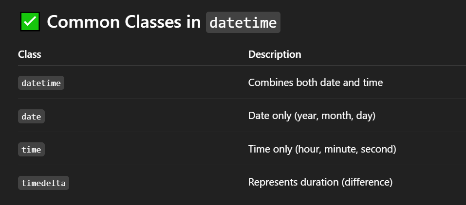
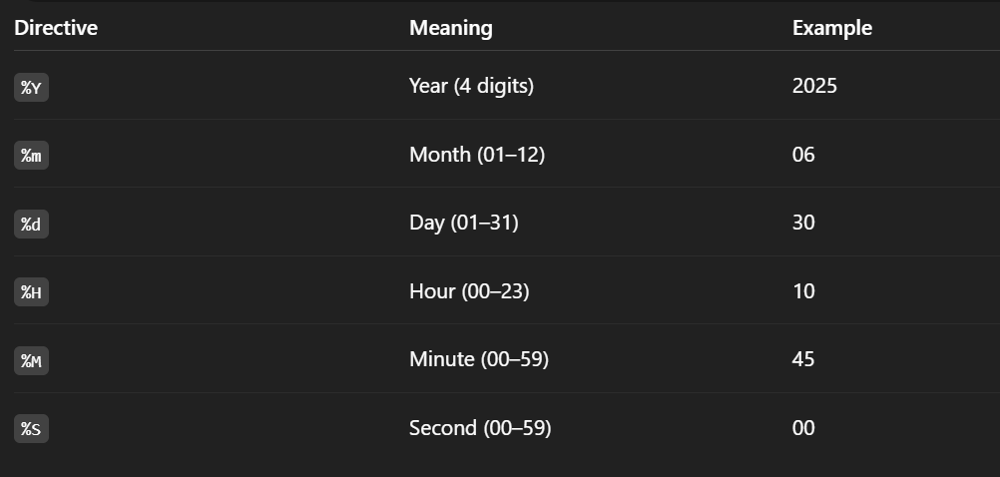

# DateTime :
- The datetime module in Python is used to work with dates and times. It allows you to create, manipulate, format, and compare date and time values.

## Importing datetime :
```
import datetime

# Or import specific classes:

from datetime import datetime, date, time, timedelta
```



## 🧭 Basic Usage :
## 1. 📅 Get Current Date and Time
```
from datetime import datetime

now = datetime.now()
print(now)  # e.g., 2025-06-30 10:45:00.123456

```

## 2. 📅 Create Specific Date/Time :
```
dt = datetime(2025, 12, 25, 18, 30)
print(dt)  # 2025-12-25 18:30:00

```

## 3. Working with date and time :
```
from datetime import date, time

d = date(2025, 6, 30)
t = time(14, 45)
print(d)  # 2025-06-30
print(t)  # 14:45:00

```

## 4. 🧮 timedelta for Date Arithmetic :
```
from datetime import timedelta

today = date.today()
tomorrow = today + timedelta(days=1)
yesterday = today - timedelta(days=1)

print("Today:", today)
print("Tomorrow:", tomorrow)
print("Yesterday:", yesterday)

```

## 5. 🧾 Formatting Dates (strftime) :
```
#Convert datetime to string with a specific format:

now = datetime.now()
formatted = now.strftime("%Y-%m-%d %H:%M:%S")
print(formatted)  # 2025-06-30 10:45:00

```


## 6. 🔄 Parsing Strings to Dates (strptime) :
```
date_str = "2025-12-25 18:30"
dt = datetime.strptime(date_str, "%Y-%m-%d %H:%M")
print(dt)  # 2025-12-25 18:30:00

```

## ⏱️ Timezone Support :
```
# For timezone-aware dates, use datetime with pytz or zoneinfo (Python 3.9+):

from datetime import datetime
from zoneinfo import ZoneInfo

dt = datetime.now(ZoneInfo("Asia/Kolkata"))
print(dt)

```