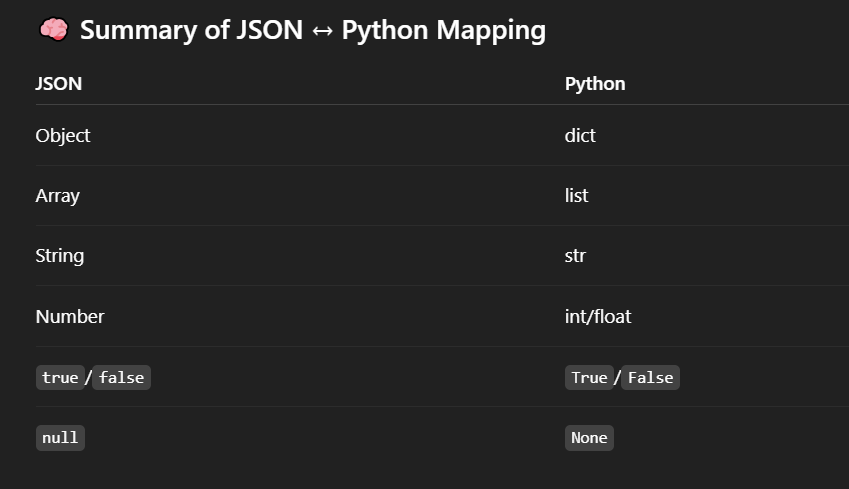

# JSON :
- JSON (JavaScript Object Notation) is a lightweight data interchange format that is easy for humans to read and write, and easy for machines to parse and generate. In Python, the built-in json module is used to work with JSON data.

## ✅ What JSON looks like :
- JSON is essentially a text format that represents data structures like:

- Objects (dictionaries in Python)

- Arrays (lists in Python)

- Strings, numbers, booleans, and null (None in Python)
```
{
  "name": "Alice",
  "age": 25,
  "is_student": false,
  "courses": ["Math", "Science"],
  "address": {
    "city": "New York",
    "zip": "10001"
  }
}

```

# Using json in Python :
## mainly use two functions : 1) json.dumps() , 2) json.loads()

## 1. json.dumps() – Convert Python object → JSON string "
```
import json

data = {
    "name": "Alice",
    "age": 25,
    "is_student": False
}

json_str = json.dumps(data)
print(json_str)

```

## 2. json.loads() – Convert JSON string → Python object :
```
json_data = '{"name": "Alice", "age": 25, "is_student": false}'

python_obj = json.loads(json_data)
print(python_obj)

```

## 📁 Working with JSON Files :
## Save Python object to a JSON file :
```
with open("data.json", "w") as f:
    json.dump(data, f)

```

## Load JSON file into Python :
```
with open("data.json", "r") as f:
    data = json.load(f)

```

