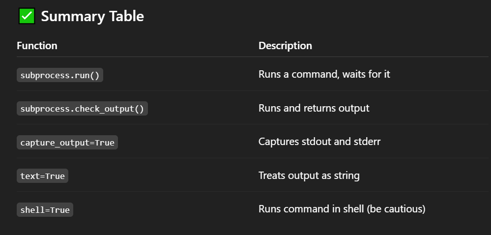

# Sub process :
- The subprocess module in Python is used to run external commands (programs or scripts) from within a Python script. 

- It gives you powerful tools to interact with the system shell and other programs, capture their output, and handle inputs/outputs/errors.


## 🔧 Why Use subprocess ?
- Run shell commands from Python (like ls, mkdir, ping, etc.).

- Run other Python scripts or programs.

- Capture output of the commands.

- Handle errors if commands fail.

## 🔹 Basic Example
```
import subprocess

# Run a simple command
subprocess.run(["echo", "Hello from subprocess!"])

Output:
Hello from subprocess!

```

## 🔹 Capturing Output :
```
result = subprocess.run(["ls"], capture_output=True, text=True)
print(result.stdout)

```
- capture_output=True → Captures the command’s output

- text=True → Returns output as string (instead of bytes)

## 🔹 Handling Errors :
```
result = subprocess.run(["ls", "non_existing_dir"], capture_output=True, text=True)

print("Return code:", result.returncode)
print("Error:", result.stderr)

```
- Non-zero returncode indicates failure

- stderr captures error message

## 🔹 Using Shell Commands :
```
subprocess.run("echo Hello && mkdir test_folder", shell=True)

```
- shell=True lets you run shell-specific syntax like &&, pipes (|), etc.

- Be careful—shell=True can be a security risk if you're using user input.

## 🔹 Run and Get Output (Shortcut) :
```
output = subprocess.check_output(["date"], text=True)
print(output)

```
- check_output returns just the output as a string.

- Raises error if the command fails.

## 🔹 Example: Running Python File :
```
subprocess.run(["python", "script.py"])

```
- This runs script.py just like from terminal.



## ✅ 1. Open a file using default application (Windows/Linux/Mac)
python
Copy
Edit
import subprocess
import platform

file_path = "example.txt"

if platform.system() == "Windows":
    subprocess.run(["start", file_path], shell=True)
elif platform.system() == "Darwin":  # macOS
    subprocess.run(["open", file_path])
else:  # Linux
    subprocess.run(["xdg-open", file_path])
## ✅ 2. Run ping to check internet or server status :
```
import subprocess

host = "google.com"
result = subprocess.run(["ping", "-c", "3", host], capture_output=True, text=True)

print("Ping output:\n", result.stdout)
-c 3: Send 3 packets (on Linux/macOS; use -n on Windows)

```

## ✅ 3. Automate Git commands :
```
import subprocess

# Initialize a Git repo :
subprocess.run(["git", "init"])

# Check git status
result = subprocess.run(["git", "status"], capture_output=True, text=True)
print(result.stdout)

```

## ✅ 4. Run another Python file and get output :
 ```
 # Let’s say you have hello.py:

# hello.py
print("Hello from another script!")

```

### Then run it like this :
```
import subprocess

result = subprocess.run(["python", "hello.py"], capture_output=True, text=True)
print("Output from script:", result.stdout)

```

## ✅ 5. List files in a folder :
```
import subprocess

result = subprocess.run(["ls", "-l"], capture_output=True, text=True)  # Linux/macOS
# On Windows: ["dir"] with shell=True   
print(result.stdout)

```

## ✅ 6. Run command and handle failure :
```
try:
    subprocess.run(["rm", "nonexistent.txt"], check=True)  # Linux/macOS
except subprocess.CalledProcessError as e:
    print("Command failed:", e)

 # check=True will raise an exception if the command fails.

```