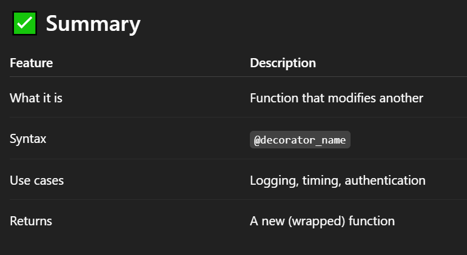

# ✅ What is a Decorator ?
- A decorator in Python is a function that modifies another function — without changing the function’s code directly.

- It’s like wrapping a gift 🎁 — the inside (function) is the same, but the outside (decorator) adds new behavior.

## ✅ Why Use Decorators ?
- ✅ Add functionality to functions (like logging, timing, access control).

- ✅ Avoid repeating code (DRY principle).

- ✅ Clean and readable code.

## ✅ Basic Decorator Example :
```
def my_decorator(func):
    def wrapper():
        print("Before the function runs")
        func()
        print("After the function runs")
    return wrapper

@my_decorator
def say_hello():
    print("Hello!")

say_hello()

# Output:
# Before the function runs
# Hello!
# After the function runs

```

# ✅ How It Works :
- @my_decorator is the syntactic sugar for:
```
say_hello = my_decorator(say_hello)

```
- It wraps say_hello inside the wrapper() function.

# ✅ Decorator with Arguments :
```
def my_decorator(func):
    def wrapper(*args, **kwargs):
        print("Calling:", func.__name__)
        return func(*args, **kwargs)
    return wrapper

@my_decorator
def add(a, b):
    return a + b

print(add(3, 4))  # Output: 7

```

# ✅ Built-in Python Decorators :
- @staticmethod

- @classmethod

- @property

