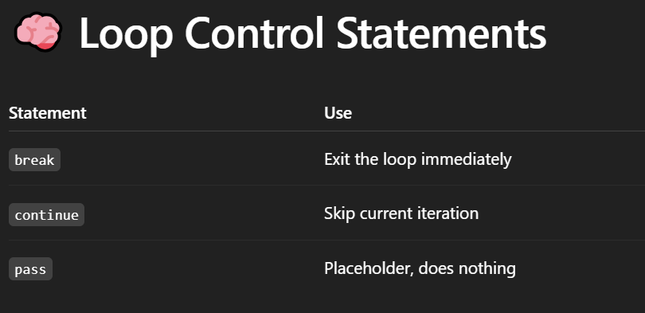

# For Loop :
- A for loop is used to iterate (loop).

## 🔁 Basic Syntax
```
for variable in sequence:
# code

```
## example :
```
fruits = ["apple", "banana", "mango"]

for fruit in fruits:
    print(fruit)

```



## ✅ Example with break :
```
for i in range(10):
    if i == 5:
        break
    print(i)

# Output: 0 1 2 3 4

```

## ✅ Example with continue
```
for i in range(5):
    if i == 2:
        continue
    print(i)

# Output: 0 1 3 4

```