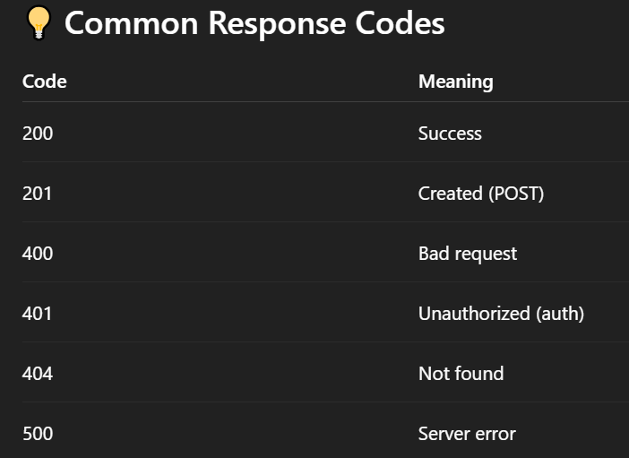

# 🔌 What is an API ?
- API (Application Programming Interface) allows two applications to talk to each other.

- Example: You use Python to request data from a website (like weather, news, or user info) using an API.

# ⚙️ How to Handle APIs in Python ?
- We use the built-in or third-party library called requests to call APIs.

## ✅ 1. Install requests (if not already installed) :
```
pip install requests

```

## ✅ 2. Make a GET Request (most common) :
```
import requests

response = requests.get("https://api.github.com")

print(response.status_code)      # 200 = success
print(response.headers)          # metadata
print(response.json())           # parsed data (dict)

```

## ✅ 3. Make a POST Request (send data) :
```
import requests

url = "https://jsonplaceholder.typicode.com/posts"
data = {
    "title": "Faizan API Test",
    "body": "This is generated using Python.",
    "userId": 1
}

response = requests.post(url, json=data)
print(response.json())
```

## ✅ 4. Add Headers (e.g. API Keys) :
```
headers = {
    "Authorization": "Bearer your_api_key",
    "Content-Type": "application/json"
}

response = requests.get("https://api.example.com/data", headers=headers)
print(response.json())
```

## ✅ 5. Handle Errors (Best Practice) :
```
try:
    response = requests.get("https://api.github.com/users/octocat")
    response.raise_for_status()
    data = response.json()
    print(data)
except requests.exceptions.HTTPError as err:
    print("HTTP error:", err)
except Exception as e:
    print("Error:", e)

```



