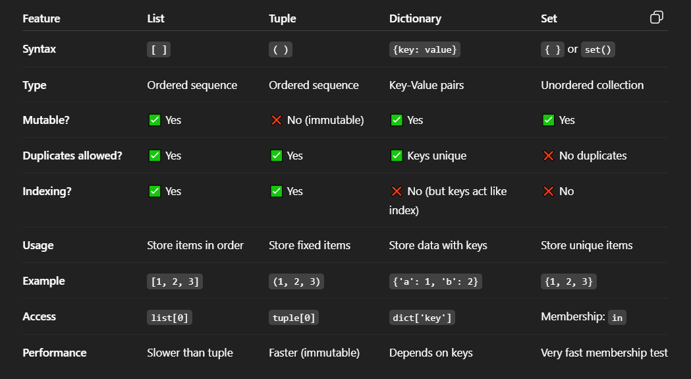
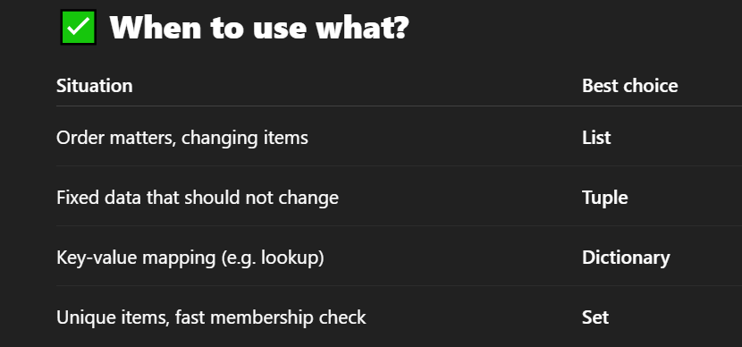

# ✅ Quick Examples :
```
fruits = ['apple', 'banana', 'cherry']
print(fruits[1])  # banana
fruits.append('orange')
```

## Tuple :
```
colors = ('red', 'green', 'blue')
print(colors[0])  # red
# colors[0] = 'yellow' → Error (tuples are immutable)
```

## Dictionary :
```
person = {'name': 'John', 'age': 30}
print(person['name'])  # John
person['age'] = 31
```

## Set :
```
nums = {1, 2, 3, 2, 1}
print(nums)  # {1, 2, 3} (duplicates removed)
nums.add(4)
```