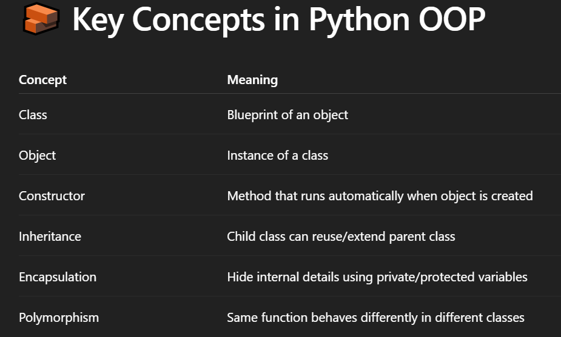
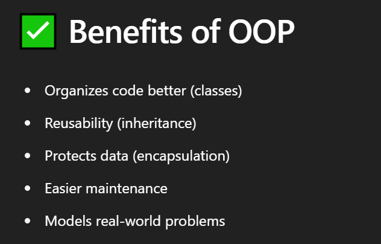
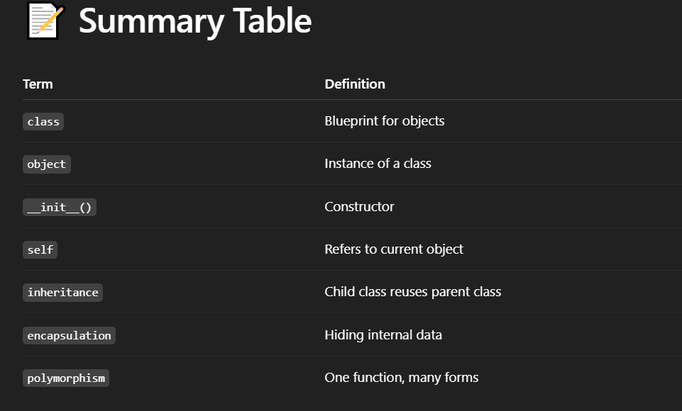

# 🧠 What is Object-Oriented Programming (OOP) ?
- OOP is a programming style where we build code using objects and classes — like how things work in the real world.

- Instead of just functions and logic, we model real-world entities (like car, student, user) as objects.



## 1️⃣ Class and Object :
```
class Student:
    def __init__(self, name, age):  # constructor
        self.name = name
        self.age = age

    def show(self):
        print(f"Name: {self.name}, Age: {self.age}")

# create object
s1 = Student("Faizan", 21)
s1.show()

```

## 2️⃣ Inheritance :
```
class Animal:
    def speak(self):
        print("Animal speaks")

class Dog(Animal):
    def speak(self):
        print("Dog barks")

a = Animal()
a.speak()  # Animal speaks

d = Dog()
d.speak()  # Dog barks

```

## 3️⃣ Encapsulation :
```
class BankAccount:
    def __init__(self, balance):
        self.__balance = balance  # private variable

    def get_balance(self):
        return self.__balance

    def deposit(self, amount):
        self.__balance += amount

acc = BankAccount(1000)
print(acc.get_balance())  # 1000
```

## 4️⃣ Polymorphism :
```
class Bird:
    def fly(self):
        print("Bird can fly")

class Penguin(Bird):
    def fly(self):
        print("Penguin can't fly")

b1 = Bird()
b2 = Penguin()

for b in (b1, b2):
    b.fly()

```

## 📦 Real-world Example :
```
class Car:
    def __init__(self, brand, speed):
        self.brand = brand
        self.speed = speed

    def drive(self):
        print(f"{self.brand} is driving at {self.speed} km/h")

car1 = Car("Toyota", 120)
car1.drive()

```



