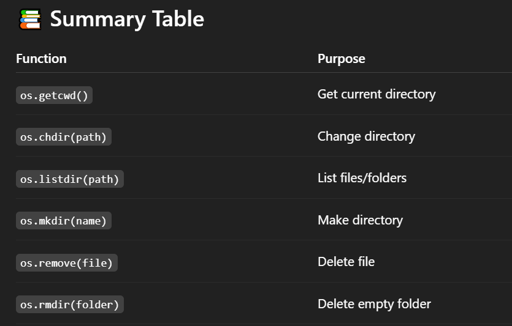
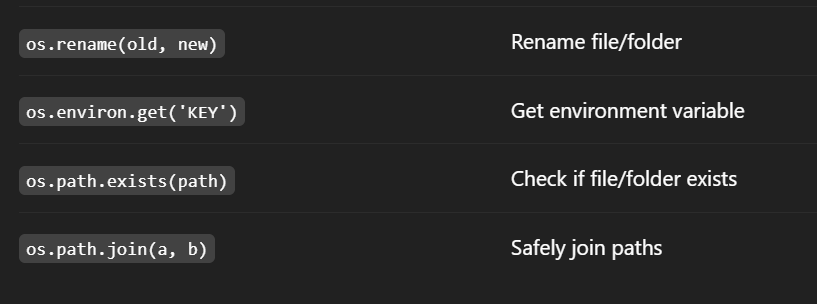

# OS Module :
- The os module in Python lets you interact with the operating system — including files, directories, environment variables, and process-level tasks.

## ✅ 1. Importing the module :
```
import os
```
# 📁 2. Working with Directories :
## ➤ Get Current Working Directory :
```
print(os.getcwd())  # e.g., /home/faizan/projects
```

## ➤ Change Directory :
```
os.chdir("path/to/folder")
```
## ➤ List Files in a Directory
```
print(os.listdir())  # Lists files in the current directory
```
## ➤ Make New Directory :
```
os.mkdir("new_folder")
```

## ➤ Make Nested Directories :
```
os.makedirs("parent/child/grandchild")
```
## ➤ Remove a Directory :
```
os.rmdir("folder_name")
```
## ➤ Remove Nested Directories :
```
os.removedirs("parent/child/grandchild")
```
# 📄 3. Working with Files :
## ➤ Rename a File :
```
os.rename("old_name.txt", "new_name.txt")
```
## ➤ Remove (Delete) a File :
```
os.remove("file.txt")
```
## ➤ Check if File/Dir Exists :
```
print(os.path.exists("file.txt"))      # True or False
print(os.path.isfile("file.txt"))      # True if it's a file
print(os.path.isdir("folder"))         # True if it's a directory
```

# 🌐 4. Working with Environment Variables :
## ➤ Get Environment Variable :
```
print(os.environ.get("HOME"))  # e.g., /home/faizan
```
## ➤ Set Environment Variable (Temporary for current session) :
```
os.environ["MY_VAR"] = "123"
```
# ⚙️ 5. Path Utilities (via os.path) :
## ➤ Join Paths :
```
file_path = os.path.join("folder", "file.txt")
```
## ➤ Get Absolute Path :
```
print(os.path.abspath("file.txt"))
```
## ➤ Get File Name or Dir Name :
```
print(os.path.basename("/home/file.txt"))  # file.txt
print(os.path.dirname("/home/file.txt"))   # /home
```

## 🧪 Example Use Case
```
import os

if not os.path.exists("demo"):
    os.mkdir("demo")

with open(os.path.join("demo", "example.txt"), "w") as f:
    f.write("Hello, Faizan!")

```    





## to make n number of folder/sub-folder :
```
import os
if(not os.path.exists("data")):
    os.mkdir("data")

for i in range(1,20):
    os.mkdir(f"data/day") 

```

## Rename folder/sub-folder :
```
import os

for i in range(1,20):
    os.rename(f"data/day", f"data/tutorial")
```

## Search for directories/folder :
```
import os

folders = ps.listdir("data")
print(folders)

for folder in folders:
    print(folder)
    print(os.listdir(f"data/{folder}"))
```