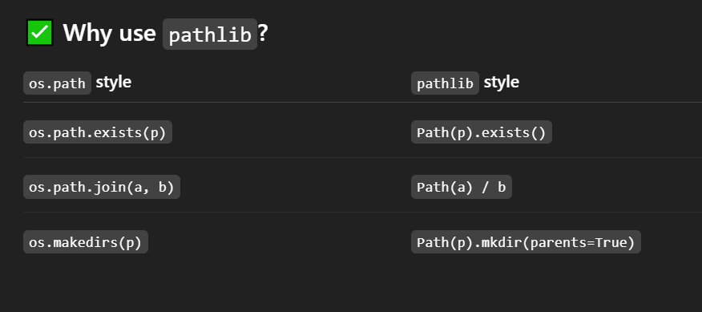
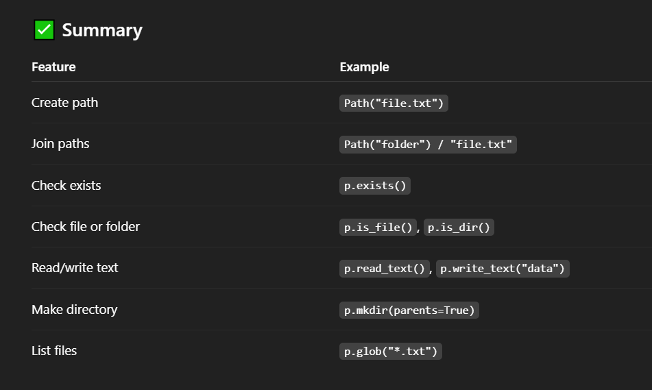

# 🧠 What is pathlib in Python ?
- pathlib is a modern, object-oriented library in Python used to handle file system paths — more readable and powerful than the old os.path module.

## ✅ Importing
```
from pathlib import Path
```



# 🧪 Basic Examples :
## ➤ Create a Path :
```
from pathlib import Path

p = Path("my_folder/my_file.txt")

print(p.name)        # my_file.txt
print(p.suffix)      # .txt
print(p.parent)      # my_folder

```

## 🔍 File/Directory Checks :
```
p = Path("example.txt")

print(p.exists())     # True or False
print(p.is_file())    # True if it's a file
print(p.is_dir())     # True if it's a folder

```

## 📁 Directory Creation :
```
Path("new_folder").mkdir()  # Create one folder
Path("a/b/c").mkdir(parents=True, exist_ok=True)  # Nested folders

```

## 📄 File Reading/Writing :
```
p = Path("hello.txt")

# Write to file
p.write_text("Hello, Faizan!")

```
## Read from file :
```
content = p.read_text()
print(content)

```

## 🔄 Join Paths :
```
base = Path("/home/faizan")
file = base / "documents" / "resume.pdf"
print(file)  # /home/faizan/documents/resume.pdf

```

## 🔍 Glob (Search Files) :
```
for file in Path(".").glob("*.txt"):
    print(file.name)
*.txt: all text files

**/*.py: all Python files recursively

```

## 🧪 Small Real Example :
```
from pathlib import Path

# Create a notes.txt file in current directory
note = Path("notes.txt")

if not note.exists():
    note.write_text("Welcome to pathlib!")
else:
    print("Already exists:", note.read_text())

```    

