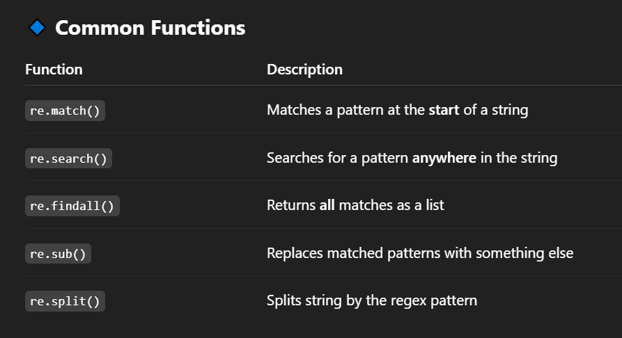
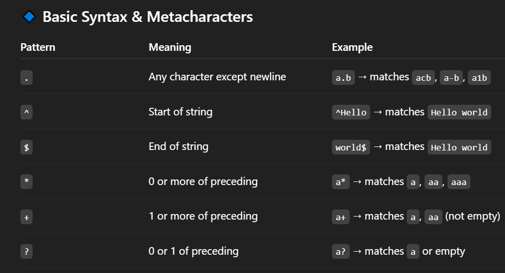
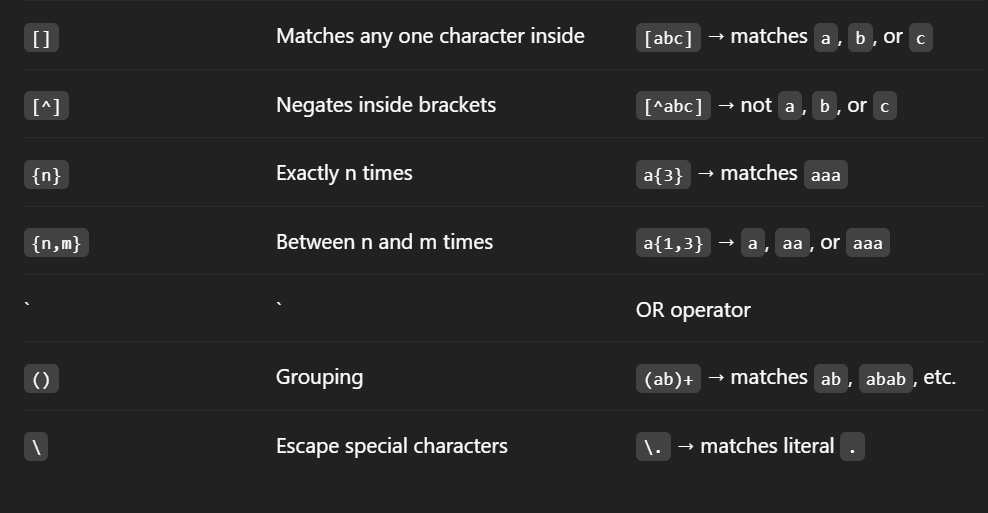
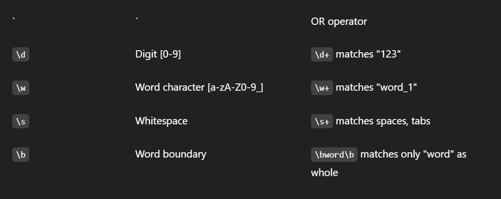
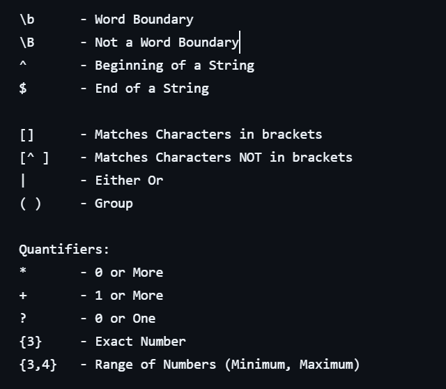
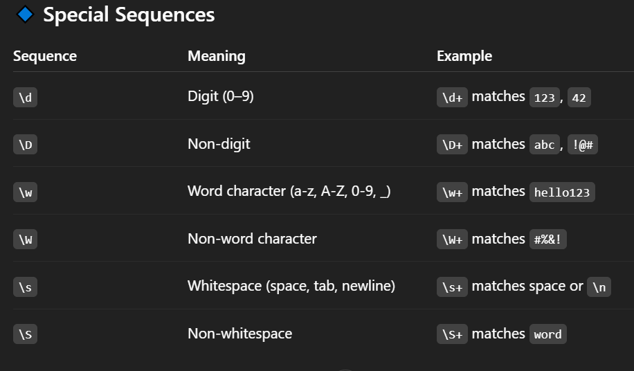
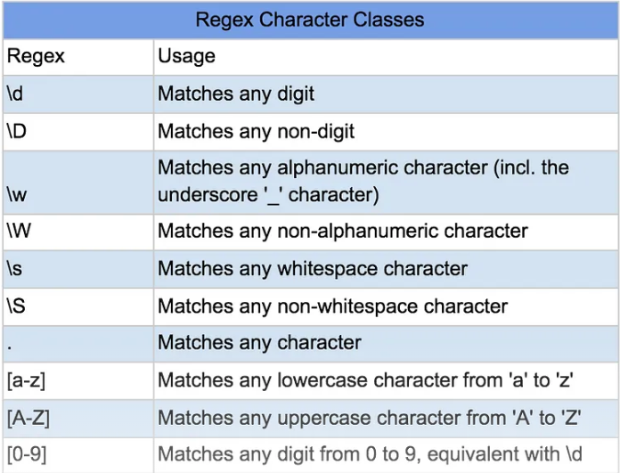

# Regular Expressions :
- Regular Expressions (regex) are a powerful way to search, match, and manipulate strings using patterns. In Python, the built-in re module provides support for regex.

## ✅ Use Cases
- Email/phone number validation

- Password validation

- Log parsing

- Text cleanup

- Data extraction

#

## 🔹 Basic Workflow :
### Import the module
```
import re
```

### Compile a pattern (optional) :
```
pattern = re.compile(r'\d+')
```

### Use methods like search(), findall(), match(), sub() etc.






## Quantifiers :





[Download PDF](assets/regex.pdf)


