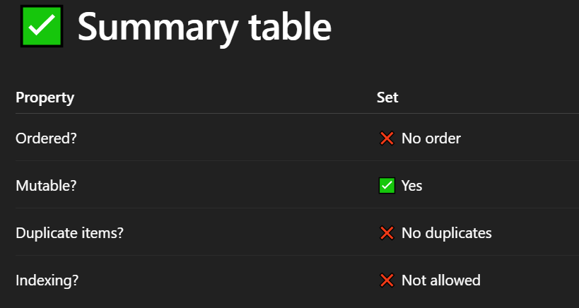

# ✅ What is a set ?
- A set is a built-in Python data structure.

- Unordered (no indexing, no positions)

- Mutable (you can add/remove items)

- No duplicates (only unique elements)

- Similar to mathematical sets.

## ✅ Why use sets ?
- To store unique items

- To perform fast membership tests (in)

- To do set operations like union, intersection, etc.

## ✅ How to create a set :
```
# Using curly braces
s = {1, 2, 3, 4, 5}

# Or using set() function
s = set([1, 2, 3, 4, 5])

# 👉 Note: Empty set must be created using set(), not {}
(because {} creates an empty dictionary)

empty_set = set() # empty set

```

## Remove elements :
```
s = {1,2,6}
s.remove(3)
print(s)  # {1, 2, 6}
# If you use remove() and the item doesn’t exist → it gives an error.

# Use discard() to avoid error if item not found:

s.discard(10)  # No error even if 10 not present

```

## checks :
```
print(2 in s)  # True
print(5 in s)  # False
```

## Length of set:
```
print(len(s))
```

## Union (| or union()) :
```
a = {1, 2, 3}
b = {3, 4, 5}
print(a | b)           # {1, 2, 3, 4, 5}
print(a.union(b))      # {1, 2, 3, 4, 5}

```

## Intersection (& or intersection()) :
```
a = {1, 2, 3}
b = {3, 4, 5}
print(a & b)    # {3}
print(a.intersection(b))  # {3}
```

## Difference (- or difference()) :
```
print(a - b)           # {1, 2}
print(a.difference(b)) # {1, 2}
```

## Symmetric Difference (^ or symmetric_difference()) :
```
print(a ^ b)  # {1, 2, 4, 5}
```

## convert string into set ?
```
text = "apple banana apple orange banana"
words = text.split()    # converting string into list
unique_words = set(words)   # converting list into set
print(unique_words)

# Output: {'apple', 'banana', 'orange'}

```

