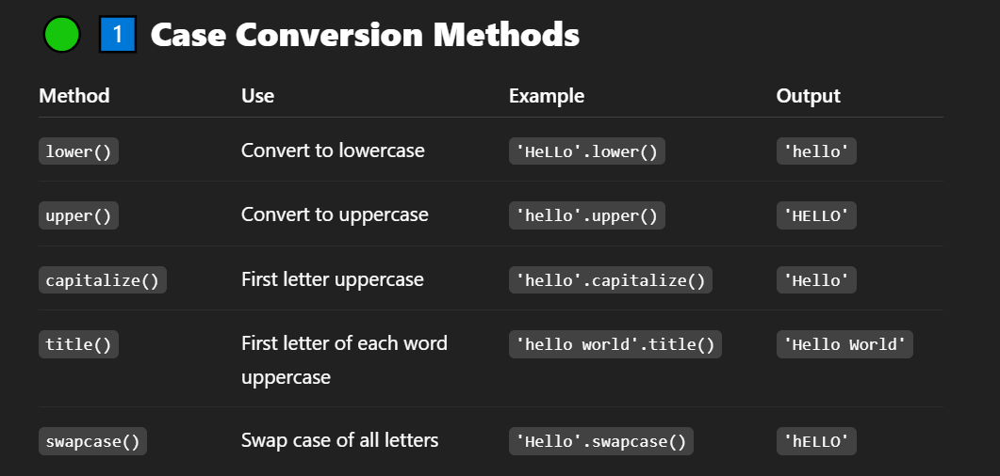
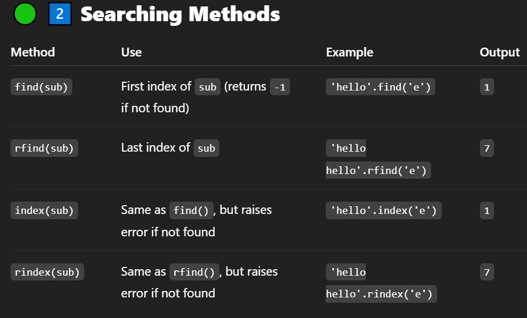
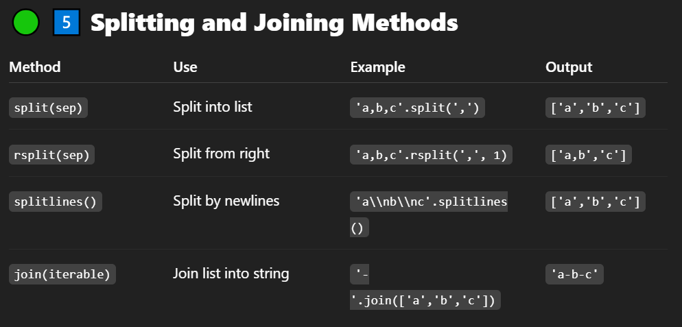
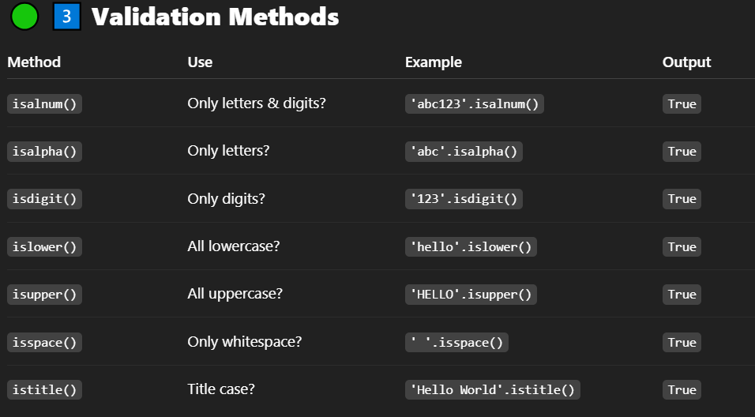
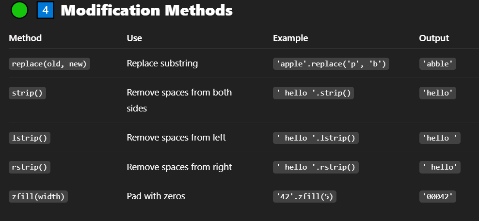
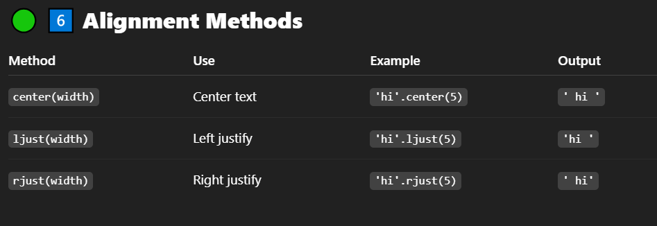

# String :
- string is a Sequence of characters.

## Case Methods : lower, upper, title, capitalize, swapcase
## Search Methods : find, index, count, startswith, endswith
## Modify Methods : replace, strip, lstrip, rstrip, zfill
## Split & Join : split, join, splitlines
## Validation : isalpha, isdigit, isalnum, isspace, istitle
## Alignment : center, ljust, rjust
## Format : format, format_map, f-strings
#

