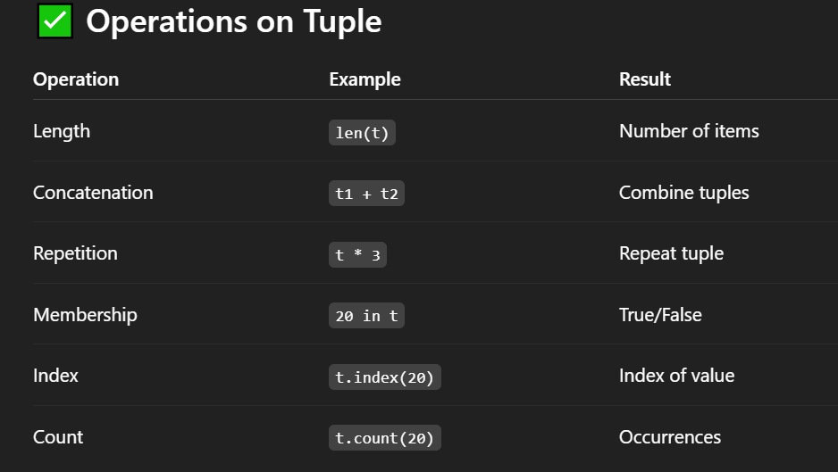

# ✅ What is a Tuple?
- An ordered collection of elements.

- Immutable (cannot be changed after creation).

- Can store heterogeneous data types.

- Allows duplicates.

- Faster and memory efficient than lists.

## ✅ Why use Tuple?
- When your data should not change.

- For data integrity and safety.

### Often used for:

- Return multiple values from function

- Unpacking

- Dictionary keys

## ✅ Creating a Tuple :
```
# Empty tuple
t = ()

# Tuple with elements
t = (10, "Python", 3.14, True)

# Tuple without parentheses (packing)
t = 10, 20, 30

# Single element tuple (VERY IMPORTANT)
t = (10,)
print(type(t))  # Output: <class 'tuple'>

```

## ✅ Accessing Tuple Elements :
```
t = (10, 20, 30, 40)

print(t[0])   # Output: 10
print(t[-1])  # Output: 40

# Slicing
print(t[1:3])  # Output: (20, 30)

```

## ✅ Immutability Example :
```
t = (10, 20, 30)
t[0] = 100  # ❌ Error: 'tuple' object does not support item assignment

# bcoz tupple is immutable in behavior.
```



## ✅ Nested Tuples :
```
t = (1, 2, (3, 4, 5), 6)
print(t[2][1])  # Output: 4

```

## ✅ Very useful when function returns multiple values :
```
def calc(x, y):
    return x+y, x-y , x*y , x/y

sum_, subs, multi , div = calc(10, 5)
print(sum_, subs ,multi ,div)

# Output: 15 5 50 2

# we can perform multiple task in function
```
