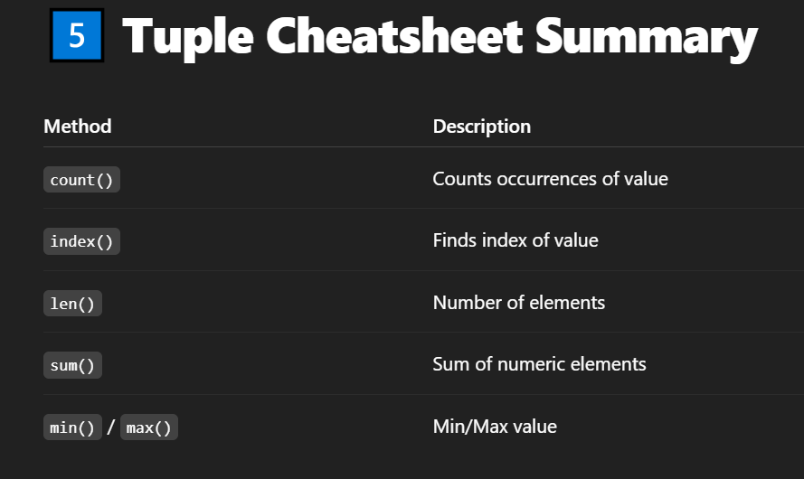

# 1️⃣ Real World Examples of Tuple Usage
## ✅ 1. Returning multiple values from a function
```
def get_name_age():
    name = "Faizan"
    age = 25
    return name, age  # tuple returned

n, a = get_name_age()
print(n, a)
```

## ✅ 2. Swapping values
```
a, b = 10, 20
a, b = b, a
print(a, b)  # Output: 20 10
```

## ✅ 3. Dictionary keys
```
# Tuple used as dict key because it's hashable
coordinates = {
    (10, 20): "Point A",
    (30, 40): "Point B"
}

print(coordinates[(10, 20)])
```

## ✅ 4. Looping with enumerate()
```
names = ["Faizan", "Ali", "Ahmed"]

for index, name in enumerate(names):
    print(index, name)
# 👉 Here, enumerate() returns a tuple (index, name).
```

## ✅ 5. Storing fixed records (like DB rows)
```
record = ("Faizan", 25, "India")
print(record)
```

# 2️⃣ Practice Problems with Solutions
## Q1️⃣ Create a tuple of 5 fruits ?
```
fruits = ("apple", "banana", "mango", "grape", "orange")
print(fruits)
```

## Q2️⃣ Access 3rd fruit ?
```
print(fruits[2])
```

## Q3️⃣ Try to modify tuple (should give error) ?
```
# fruits[0] = "kiwi"  # ❌ TypeError
```

## Q4️⃣ Concatenate 2 tuples ?
```
t1 = (1, 2, 3)
t2 = (4, 5, 6)
result = t1 + t2
print(result)
```
## Q5️⃣ Count number of occurrences of "apple" ?
```
print(fruits.count("apple"))
```

## Q6️⃣ Find index of "mango" ?
```
print(fruits.index("mango"))
```

# 3️⃣ Top Interview Questions ?
## Q1: Why tuples are immutable ?
- ✅ Because they are designed for fixed data collections where modification is not allowed.
- ✅ More efficient & hashable.

## Q2: Can a tuple store mutable objects ?
- ✅ Yes. But tuple itself stays immutable.
```
t = ([1, 2], 3)
t[0].append(4)
print(t)  # ([1, 2, 4], 3)
```

## Q3: Is tuple faster than list ?
- ✅ Yes — since it’s immutable, Python can optimize memory and speed.

## 4️⃣ Mini Project: Coordinates Lookup ?
```
coordinates = {
    (28.6139, 77.2090): "Delhi",
    (19.0760, 72.8777): "Mumbai"
}

location = coordinates.get((28.6139, 77.2090))
print(location)  # Output: Delhi

```
